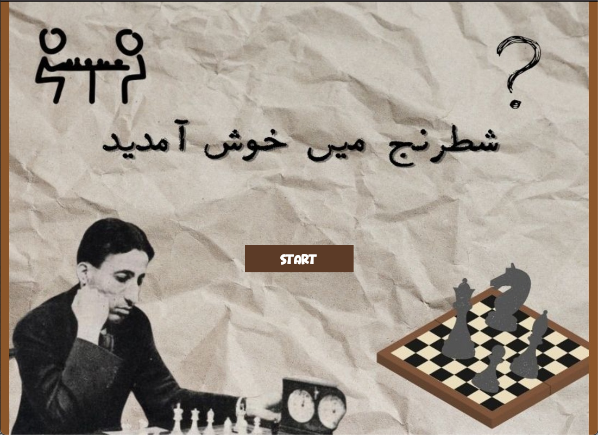

# Team 11
Section L1
Maira, Laiba, Hoorain

For our Object Oriented Programming Project in C++, we have made a chess game.

## How to Run

Load the following in terminal:
~~~
$ cd src
$ export DYLD_LIBRARY_PATH=/opt/homebrew/lib:$DYLD_LIBRARY_PATH
$ g++ -o game *.cpp -lsfml-graphics -lsfml-window -lsfml-system
$ ./game
~~~
